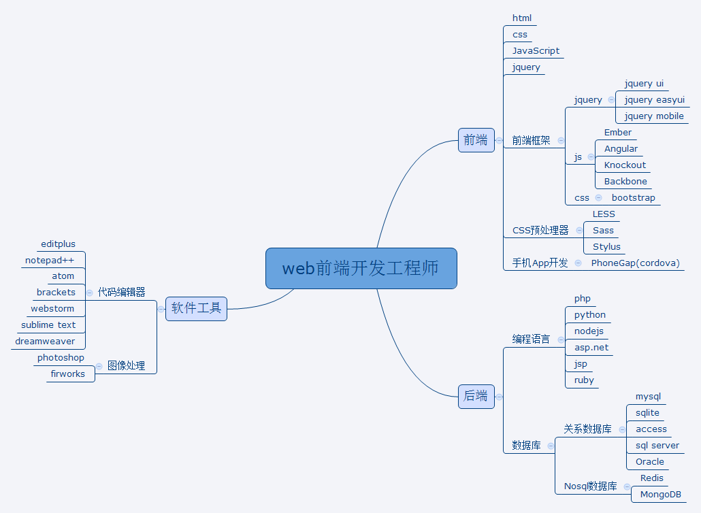
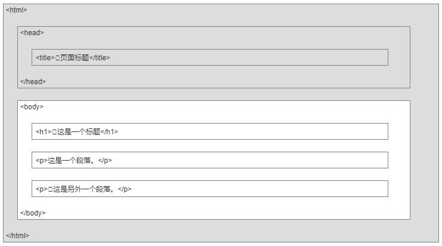
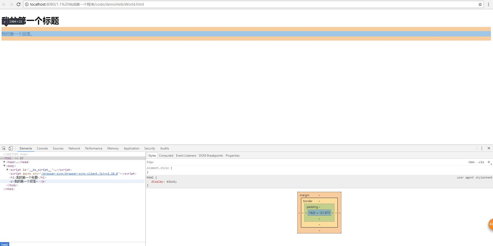

# 1.1 前端开发工程师

# 1.2 前端技能图

# 1.3 HTML 前端的发展

# 1.4 HTML 简介
- 页面：由来万维网上的一个超媒体文档称之为一个页面。

- 主页：作为一个组织或者个人在万维网上放置开始点的页面称主页 （外语：Homepage）或首页，主页中通常包括有指向其他相关页面或其他节点的指针（超级链接）。

- 超级链接：就是一种统一资源定位器（Uniform Resource  Locator，外语缩写URL）通过激活（点击）它，可使浏览器方便地获取新的网页。这也是HTML获得广泛应用 的最重要的原因之一。

- 网站：在逻辑上将视为一个整体的一系列页面的有机集合称为网（WebSite)。
超级文本标记 语言（英文缩写：HTML）是为“网页创建和其它可在网页浏 览器中看到的信息”设计的一种标记语言。

[教程地址](http://www.runoob.com/html/html-tutorial.html)  

## HTML 网页结构
下面是一个可视化的HTML页面结构：
 
## HTML 标签
 HTML 标记标签通常被称为 HTML 标签 (HTML tag)。
HTML 标签是由尖括号包围的关键词，比如 <html>
HTML 标签通常是成对出现的，比如 <b> 和 </b>
标签对中的第一个标签是开始标签，第二个标签是结束标签
开始和结束标签也被称为开放标签和闭合标签
<标签>内容</标签>
## HTML 元素
"HTML 标签" 和 "HTML 元素" 
通常都是描述同样的意思.
但是严格来讲, 一个 HTML 
元素包含了开始标签与结束标签，

## 实例解析
- \<!DOCTYPE html> 声明为 HTML5 文档
- \<html> 元素是 HTML 页面的根元素
- \<head> 元素包含了文档的元（meta）数据
- \<title> 元素描述了文档的标题
- \<body> 元素包含了可见的页面内容
- \<h1> 元素定义一个大标题
- \
 元素定义一个段落

## 中文编码

目前在大部分浏览器中，直接输出中文会出现中文乱码的情况，这时候我们就需要在头部将字符声明为 UTF-8。

    <!DOCTYPE html>
    <html>
    <head>
        <meta charset="utf-8">
        <title>菜鸟教程(runoob.com)</title>
    </head>
    <body>

        <h1>我的第一个标题</h1>

        
我的第一个段落。

    </body>
    </html>

## <!DOCTYPE> 声明
<!DOCTYPE>声明有助于浏览器中正确显示网页。
网络上有很多不同的文件，如果能够正确声明HTML的版本，浏览器就能正确显示网页内容。
doctype 声明是不区分大小写的，以下方式均可： 
<!DOCTYPE html> 
<!DOCTYPE HTML> 
<!doctype html> 
<!Doctype Html>
## 通用声明

   
查看完整网页声明类型[DOCTYPE 参考手册](http://www.runoob.com/tags/tag-doctype.html) 。

# 1.5 Web 浏览器
Web浏览器（如谷歌浏览器，
Internet Explorer，Firefox，Safari）

## 关于浏览器的介绍
浏览器：是用于读取HTML文件，并将其作为网页显示。浏览器并不是直接显示的HTML标签，但可以使用标签来决定如何展现HTML
- 使用Trident内核的浏览器：IE、Maxthon、TT、The World等；
- 使用Gecko内核的浏览器：Netcape6及以上版本、FireFox、MozillaSuite/SeaMonkey；
- 使用Presto内核的浏览器：Opera7及以上版本；
- 使用Webkit内核的浏览器：Safari、Chrome。

# 1.6 HTML 编辑器
可以使用专业的 HTML 编辑器来编辑 HTML，菜鸟教程为大家推荐几款常用的编辑器：

Visual Studio Code:  https://code.visualstudio.com/?wt.mc_id=vscom_downloads

Sublime Text：http://www.sublimetext.com/

Notepad++：https://notepad-plus-plus.org/

HBuilder：http://www.dcloud.io/kkkkkkk

## 编辑器的安装
visual studio code 安装

## 让学员熟悉编辑器
常用的一些快捷键
Ctrl+N  Ctrl+S Ctrl+Z  Ctrl+X  Ctrl+A Ctrl+C  Ctrl+X
Ctrl+Tab Ctrl+H  Ctrl+F

# 1.7 编写第一个程序
让学员自己编程人生第一个程序hello world!

## 编写第一个程序步骤

打开编辑器visual studio code

新建文件  

文件保存

写代码
<!DOCTYPE html>
    <html>
    <head>
        <meta charset="utf-8">
        <title>菜鸟教程(runoob.com)</title>
    </head>
    <body>
        <h1>我的第一个标题</h1>
        
我的第一个段落。

    </body>
    </html>

## 调试

在浏览器中查看网页元素。
查看元素操作的步骤
鼠标右键查看

# 1.8 作业
- 以网页的形式介绍自己。介绍自己的内容主要有：姓名 、年龄、爱好、性别、家庭成员、所在教会。

- 要求使用以下标签 \
 \
 \<strong> \<h1> \<i>斜体  \<b>  \上标     \下标 并且在\<title>\</title>里填上自己的名字

- 按照图片来完成（如果您能做出比这个要求更好的网页可以不按这个做)
  
  

