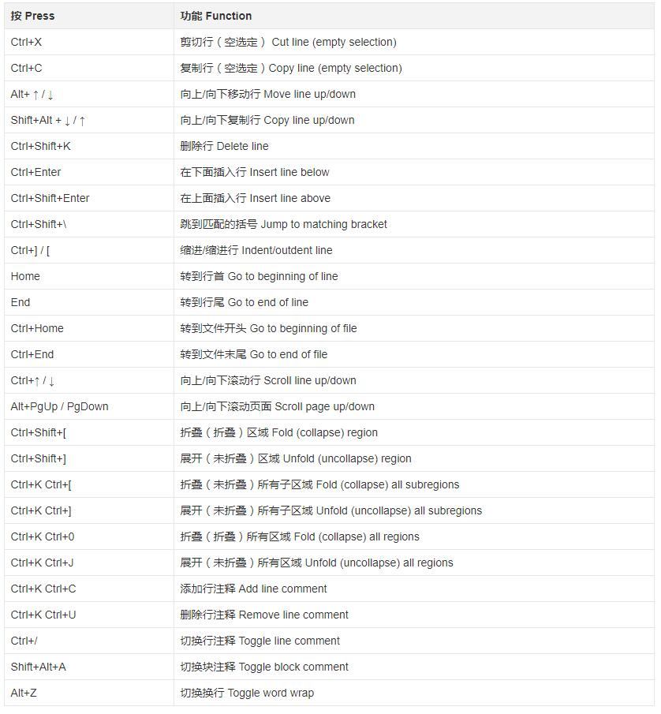
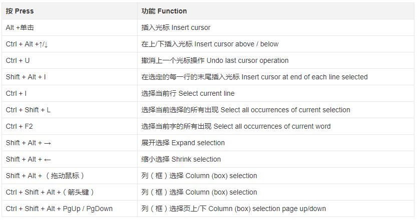

# 4 编辑器快捷键 和 Emment 快捷键
## 4.1 编辑器快捷键
- 基础编辑快捷键

- 搜索和替换

- 多光标和选择

## 4.2 Emment 快捷键

Emmet-前端开发神器
Emmet是一款编辑器插件，支持多种编辑器支持。
在前端开发中，Emmet 使用缩写语法快速编写 HTML、
CSS 以及实现其他的功能，极大的提高前端开发效率。

[下载地址   http://emmet.io/download/](http://emmet.io/download/)

缩写
Emmet使用特殊的表达式Abbreviations，
也就是缩写：这种特殊的表达式会被Emmet
解析并转义成结构化的代码块。
Emmet使用类似CSS选择器的语法来描述元素
在DOM树节点的位置和属性。

例如

#page>div.logo+ul#navigation>li*5>a{Item $}会被转义成

    

        

        <ul id="navigation">
            <li><a href="">Item 1</a></li>
            <li><a href="">Item 2</a></li>
            <li><a href="">Item 3</a></li>
            <li><a href="">Item 4</a></li>
            <li><a href="">Item 5</a></li>
        </ul>
    

HTML元素

在Emmet中可以使用元素名例如 div 或 p 生成HTML标签。
Emmet   没有预设任何标签名，所以可以使用任何可用名称来 生成HTML标 签：div → \
\
 或 foo →  \<foo>\</foo>

嵌套操作符

嵌套操作用来生成元素的DOM树中的兄弟节点或子节点

child：>

使用 > 生成元素子节点
div>ul>li
会被转义成

    

        <ul>
            <li></li>
        </ul>
    

Sibling: +

使用 + 生成元素兄弟节点 div+p+bq 会被转义成

    

    

    <blockquote></blockquote>
Climb-up: ^

使用 ^ 在元素父节点生成新的元素节点
操作符 ^ 的作用和 > 刚好相反

用 > 可以在子级生成新的节点

div+div>p>span+em会被转义成

    

    

        
<em></em>

    

用 ^ 可以在父级生成新的节点

div+div>p>span+em^bq会被转义成

    

    

        
<em></em>

        <blockquote></blockquote>
    

用n个 ^ ，就可以在第n父级生成新的节点

div+div>p>span+em^^^bq会被转义成

    

    

        
<em></em>

    

    <blockquote></blockquote>
Multiplication: *

使用 * 生成多个相同元素ul>li*5会被转义成

    <ul>
        <li></li>
        <li></li>
        <li></li>
        <li></li>
        <li></li>
    </ul>
Grouping: ()

圆括号 () 是Emmet的高级用法，用来实现比较复杂的DOM结构
div>(header>ul>li*2>a)+footer>p会被转义成

    

        <header>
            <ul>
                <li></li>
                <li></li>
            </ul>
        </header>
        <footer>
            

        </footer>
    

还可以嵌套使用圆括号 () (div>dl>(dt+dd)*3)+footer>p会被转义成

    

        <dl>
            <dt></dt>
            <dd></dd>
            <dt></dt>
            <dd></dd>
            <dt></dt>
            <dd></dd>
        </dl>
    

    <footer>
        

    </footer>

属性操作符:用来修改元素的属性。

ID 和 CLASS

Emmet给元素添加ID和CLASS的方法和CSS的语法类似
div#header+div.page+div#footer.class1.class2.class3会被转义为

    

    

    

自定义属性

使用[attr]标记来添加自定义属性td[title="Hello world!" colspan=3]会被转义为

    <td title="Hello world!" colspan="3"></td>

元素编号

使用 $ 操作符可以对重复元素进行有序编号ul>li.item$*5会被转义为

    <ul>
        <li class="item1"></li>
        <li class="item2"></li>
        <li class="item3"></li>
        <li class="item4"></li>
        <li class="item5"></li>
    </ul>
还可以用多个 $ 定义编号的格式 ul>li.item$$$*5 会被转义为

    <ul>
        <li class="item001"></li>
        <li class="item002"></li>
        <li class="item003"></li>
        <li class="item004"></li>
        <li class="item005"></li>
    </ul>

更灵活的编号方式

使用 @ 修饰符可以改变编号的格式
例如：在 $ 后面添加 @- 可以改变编号顺序ul>li.item$@-*5会被转义成

    <ul>
        <li class="item5"></li>
        <li class="item4"></li>
        <li class="item3"></li>
        <li class="item2"></li>
        <li class="item1"></li>
    </ul>
在 $ 后面添加 @N 可以改变编号基数ul>li.item$@3*5会被转义为

    <ul>
        <li class="item3"></li>
        <li class="item4"></li>
        <li class="item5"></li>
        <li class="item6"></li>
        <li class="item7"></li>
    </ul>
还可以组合使用上面的修饰符ul>li.item$@-3*5会被转义为

    <ul>
        <li class="item7"></li>
        <li class="item6"></li>
        <li class="item5"></li>
        <li class="item4"></li>
        <li class="item3"></li>
    </ul>
文本操作符Emmet使用 Text:{} 给元素添加文本内容a{Click me}会被转义为

    <a href="">Click me</a>
注意： {text} 在Emmet中是被当成单独的元素来解析的，
但当和其他元素结合使用时会有特殊的含义

例如：

a{click} 和 a>{click 
会输出相同的结果，但
a{click}+b{here} 和 a>{click}+b{here} 
输出的结果则不一样

[教程](http://wow.techbrood.com/tools/emmet/cs.html)

# 4.3 作业 
- 练习 emment 能够熟练使用
- 练习 编辑器快捷键
Ctrl+Home Ctrl + End  Ctrl + Left Arrow(左移)
Ctrl + Right Arrow（右移） Ctrl + Up（上移）
Ctrl + Down Arrow（下移）
Shift + Left Arrow	Shift + Left Arrow
Shift + Right Arrow	Shift + Up Arrow	
Shift + Down Arrow	Shift + Ctrl + Left	
Shift + Ctrl + Right	Shift + Ctrl + Up	
Shift + Ctrl + Down	Shift + Home Shift + End