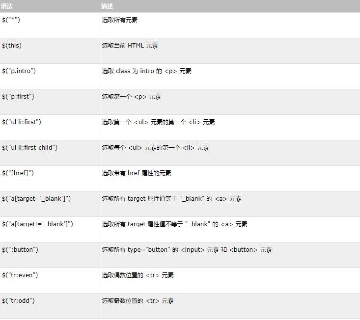

# JQuery教程
## 1.1 JQuery的特点
- JQuery 是一个 JavaScript 库。
- JQuery 极大地简化了 JavaScript 编程。
- JQuery 很容易学习。

## 1.2 JQuery 的简介
 - JQuery在2006年1月由美国人John Resig在纽约的barcamp发布，吸引了来自世界各地的众多JavaScript高手加入，由Dave Methvin  率领团队进行开发。

 - 如今，JQuery已经成为最流行的javascript库，在世界前10000个访问最多的网站中，有超过55%在使用JQuery。

 - JQuery是免费、开源的，使用MIT许可协议。

 - JQuery的语法设计可以使开发者更加便捷，例如操作文档对象、选择DOM元素、制作动画效果、事件处理、使用Ajax以及其他功能。

- 除此以外，JQuery提供API让开发者编写插件。其模块化的使用方式使开发者可以很轻松的开发出功能强大的静态或动态网页。

## 1.3 JQuery应该具备的基础知识
- HTML
- CSS
- JavaScript

## 1.4 JQuery库包括以下功能
- HTML 元素选取
- HTML 元素操作
- CSS 操作
- HTML 事件函数
- JavaScript 特效和动画
- HTML DOM 遍历和修改
- AJAX

## 1.5 jQuery 安装
- 引用JQuery库可以从网上下载 网址为：http://jquery.com/download/
- 也可使用cdn的方式，cdn方式是外网提供的，得在连网的情况下使用。常用的cdn网址   http://cdn.static.runoob.com/libs/jquery/1.10.2/jquery.min.js

## 1.6 特效展示
- JQuery特效非常强大，网上代码也很多，多数以插件的形式出现，使用非常方便。

## 1.7 jQuery 语法
通过 jQuery，您可以选取（查询，query） HTML 元素，并对它们执行"操作"（actions）。

jQuery 语法是通过选取 HTML 元素，并对选取的元素执行某些操作。
- 基础语法： $(selector).action()
- 美元符号定义 jQuery
- 选择符（selector）"查询"和"查找" HTML 元素
- jQuery 的 action() 执行对元素的操作

实例:
- $(this).hide() - 隐藏当前元素
- $("p").hide() - 隐藏所有段落
- $("p .test").hide() - 隐藏所有 class="test" 的段落
- $("#test").hide() - 隐藏所有 id="test" 的元素

文档就绪事件

您也许已经注意到在我们的实例中的所有 jQuery 函数位于一个 document ready 函数中：

    $(document).ready(function(){

    // 开始写 jQuery 代码...

    }); 

    简洁写法（与以上写法效果相同）:
    $(function(){

    // 开始写 jQuery 代码...

    }); 

## 1.8 JQuery选择器

- jQuery 选择器允许您对 HTML 元素组或单个元素进行操作。 
- jQuery 选择器基于元素的 id、类、类型、属性、属性值等"查找"（或选择）HTML 元素。它基于已经存在的 CSS 选择器，除此之外。
- jQuery 中所有选择器都以美元符号开头：$()。

元素选择器
- jQuery 元素选择器基于元素名选取元素。
- 在页面中选取所有 
 元素:
  $("p")

\#id 选择器
- jQuery #id 选择器通过 HTML 元素的 id 属性选取指定的元素。
- 页面中元素的 id 应该是唯一的，所以您要在页面中选取唯一的元素需要通过 #id 选择器。
通过 id 选取元素语法如下：

    \$(document).ready(function(){ 
     \$("button").click(function(){ 
          $("#test").hide(); 
      }); 
    });

.class 选择器

- jQuery 类选择器可以通过指定的 class 查找元素。
- 语法如下：

CSS 选择器

- jQuery CSS 选择器可用于改变 HTML 元素的 CSS 属性。
- 实例

下面的例子把所有 p 元素的背景颜色更改为红色： 

## 1.9 JQuery事件